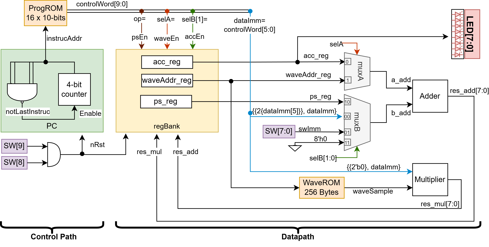
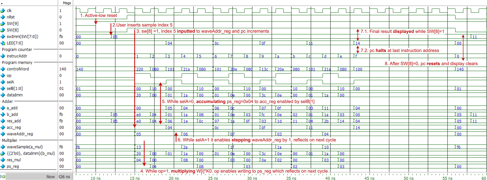
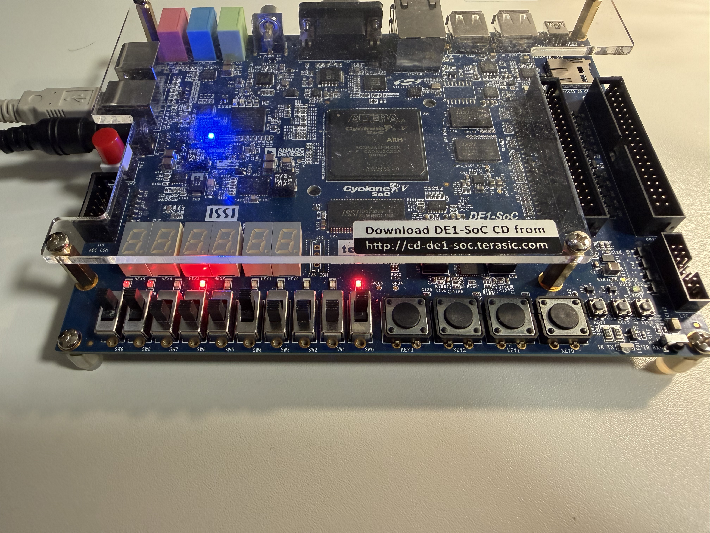
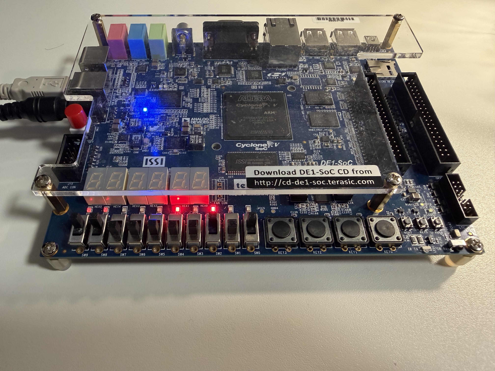

# Gaussian Smoothing Processor

A custom 8-bit processor implemented in SystemVerilog that performs 1D Gaussian smoothing on a noisy waveform, designed to use the smallest possible FPGA area. Synthesised and demonstrated on an Intel Cyclone V SoC.

In plain terms: a 256-sample noisy waveform is stored on the FPGA, you enter a sample number on the board's switches, and the processor returns the smoothed value of that sample on the LEDs. Smoothing means averaging each sample with its neighbours to reduce noise. To use it, set the sample number on SW[7:0] and raise SW[8] from low to high; the processor then runs the convolution and holds the result on the LEDs for as long as SW[8] stays high. Pulling SW[8] back low resets it ready for the next sample, and SW[9] is an active-low master reset.

## The Challenge

The task was to design a *programmable processor* that computes a 5-point Gaussian smoothing convolution, while minimising hardware area on the target FPGA (a Cyclone V 5CSEMA5F31C6). The design space was open, with any instruction set, instruction format, and architecture allowed, but the result had to remain a genuine processor, with a distinct control path and data path and a program stored in memory, rather than a fixed-function circuit.

Area was measured by an explicit cost function:

```
Cost = ALMs + 500 × max(0, DSP_blocks − 2) + 30 × RAM_Kbits
```

**The final design achieves a cost of 54**, using 54 ALMs, a single DSP block, and zero memory bits.

## The Computation

Gaussian smoothing reduces noise in a signal by replacing each sample with a weighted average of itself and its neighbours, which blurs sharp transitions much like a low-pass filter. For each sample index `i`, the processor computes:

```
S[i] = W[i-2]·K2 + W[i-1]·K1 + W[i]·K0 + W[i+1]·K1 + W[i+2]·K2
```

over a stored 256-sample noisy waveform `W`, using the 5-point Gaussian kernel **K = {14, 26, 32, 26, 14}**. The kernel values are scaled up by 7 bits so the fixed-point arithmetic can be done with 8-bit integers; the relevant bits are then extracted from each product to undo the scaling. Kernel values are immediate data stored in the control words ([`prog.text`](data/prog.text)), and can be changed as need be.

## Architecture

The design is a **NISC (No Instruction Set Computer)**. Its datapath derives from a stripped-down MIPS-style core, leaving only what this single application needs.

Crucially, there is **no instruction decoder**. Each program word is a *control word* whose bits drive the datapath's multiplexers and write-enables directly. This was a deliberate area trade-off: a conventional decoder consumes a considerable number of ALMs, and for an application this small, storing slightly wider control words in program memory turned out to cost less logic than decoding compact instructions. Trial and error during synthesis confirmed the wider-memory approach won on area.



### Datapath

Three purpose-built registers, an 8-bit signed multiplier, and an 8-bit adder with two input multiplexers:

- `ps_reg`: holds the multiplier result (partial product)
- `acc_reg`: accumulates the running sum and drives `LED[7:0]` directly
- `waveAddr_reg`: holds the current sample address

The multiplier's inputs are hardwired to the wave sample and the immediate field, since multiplication only ever happens between a sample and a kernel coefficient. The multiplexer select lines double as register write-enables, removing the need for separate write-enable logic.

### Control Path

A 4-bit program counter steps through 16 control words with no branching. It halts at the final address, a zero-offset NOP, freezing the result on the LEDs until reset. The program visits samples in the order W[i] → W[i+1] → W[i+2] → W[i-2] → W[i-1], which reduces all address arithmetic to a single negative step, implemented as a sign-extended immediate rather than dedicated subtraction hardware.

### Control Word Format

Each 10-bit control word is 4 control bits plus a 6-bit immediate:

| Type | Encoding `{op,selA,selB}` | Action |
|------|---------------------------|--------|
| Input | `0_1_01` | `waveAddr_reg <= waveAddr_reg + switch_input` |
| Multiply | `1_0_00` | `ps_reg <= waveSample × zero_ext(imm)` |
| Accumulate | `0_0_10` | `acc_reg <= acc_reg + ps_reg` |
| Step | `0_1_00` | `waveAddr_reg <= waveAddr_reg + sign_ext(imm)` |

## Verification

The RTL was verified against a golden reference model. A C program (`c-scripts/reference_model.c`) computed the expected convolution output for all 252 valid sample indices (`i = 2..253`; the outermost samples have too few neighbours for a 5-point kernel). These values were embedded as a reference array in a SystemVerilog testbench, which sweeps every valid index, drives the design through a full execution cycle, and compares each result automatically.



*Simulation trace for index i=5, showing instruction execution, register latching, and the counter halting at address 0xF with the result held on the LEDs.*

## FPGA Demo

Synthesised in Quartus and run on a DE1-SoC board, using the provided clock divider to debounce the mechanical switches. Outputs were verified by hand against the golden reference.

<p align="center">
  
  &nbsp;&nbsp;
  
</p>

*Left: i=0x11 → 0x41.  Right: i=0x05 → 0x14. Both match the simulated reference.*

## Synthesis Results

| Resource | Used |
|----------|------|
| ALMs | 54 |
| DSP blocks (9×9 mode) | 1 |
| Memory bits | 0 |
| **Total cost** | **54** |

## Project Structure

```
├── rtl/                 # SystemVerilog design source
│   ├── picoNISC.sv      # Top-level processor
│   ├── picoMIPS4test.sv # FPGA test wrapper (with clock divider)
│   ├── counter.sv       # Clock divider for switch debouncing
│   ├── progROM.sv       # Program memory (control words)
│   ├── waveROM.sv       # Waveform sample ROM
│   ├── regBank.sv       # Register bank
│   ├── pc.sv            # Program counter
│   ├── mul.sv           # 8-bit signed multiplier
│   ├── adder.sv         # 8-bit adder
│   └── adderMux.sv      # Adder input multiplexers
├── tb/                  # Testbench
│   ├── tb_picoNISC.sv   # Self-checking testbench
│   └── wave.do          # ModelSim waveform script
├── data/                # Memory initialisation files
│   ├── wave.hex         # 256-sample noisy waveform
│   └── prog.text        # 16-word program
├── c-scripts/           # Golden reference model
│   └── reference_model.c
├── quartus/             # Quartus project files
├── docs/                # Figures
└── Makefile             # Build/run targets (ModelSim + Verilator)
```

## Build & Run

**Requirements:** a SystemVerilog simulator (ModelSim or Verilator + Surfer wave viewer) and, for synthesis, Intel Quartus Prime.

```bash
make run      # simulate with ModelSim (terminal)
make gui      # simulate with ModelSim (waveform viewer)
make vsim     # simulate with Verilator
make vwave    # Verilator + open waveform in Surfer
make clean    # remove generated files
```

For synthesis, open the project in `quartus/`, target the Cyclone V 5CSEMA5F31C6, and compile. Program onto a DE1-SoC for hardware testing.

## License

Developed as university coursework. Free to use as a reference.
